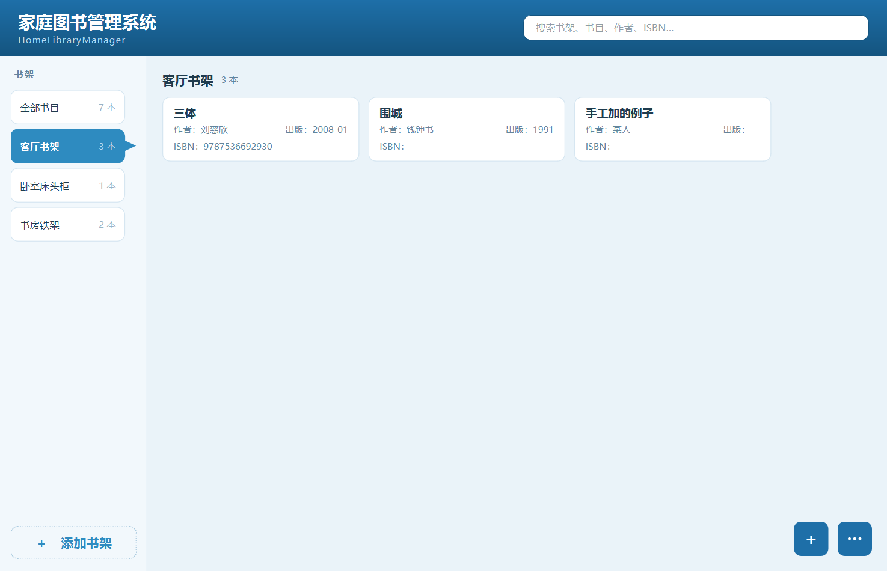
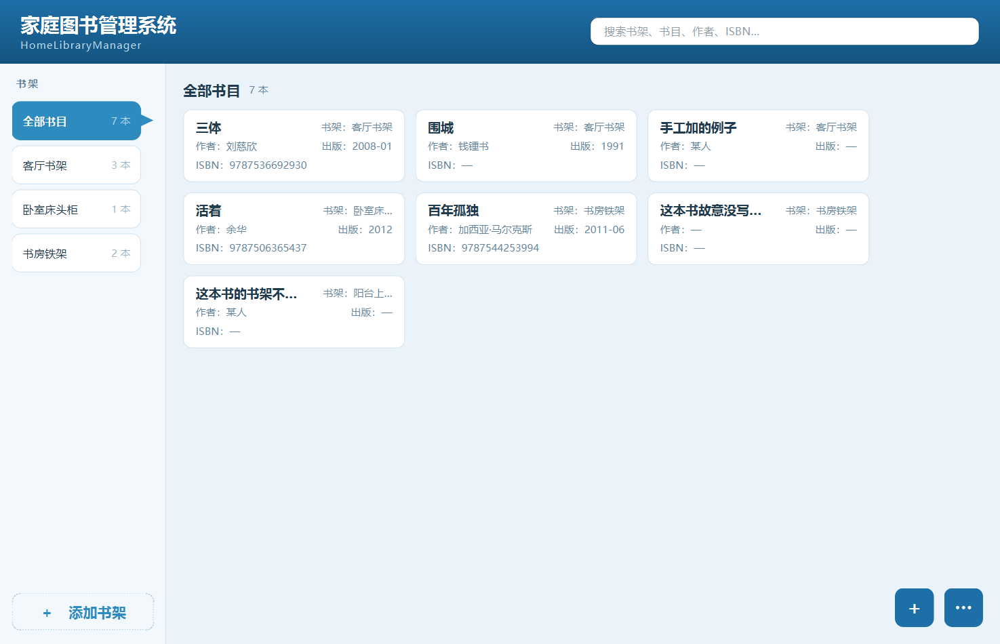
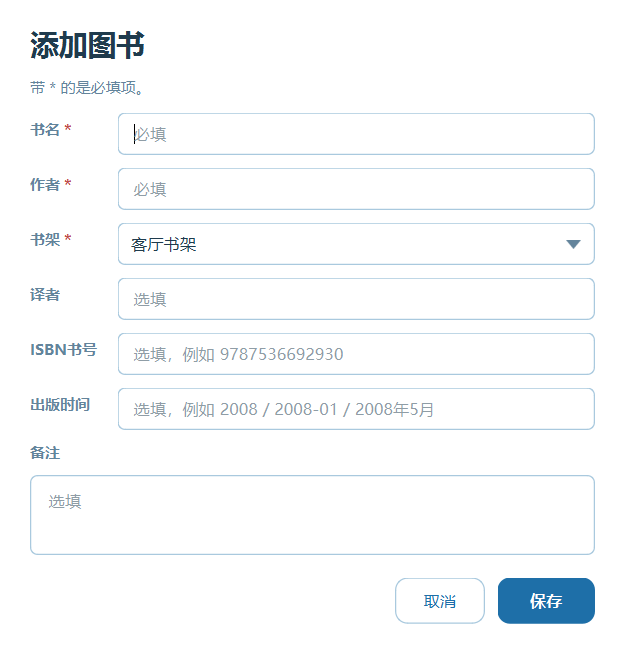
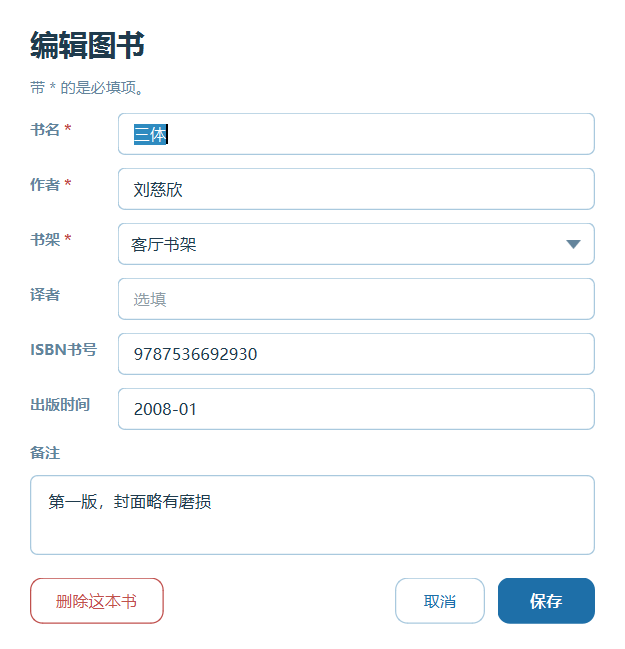
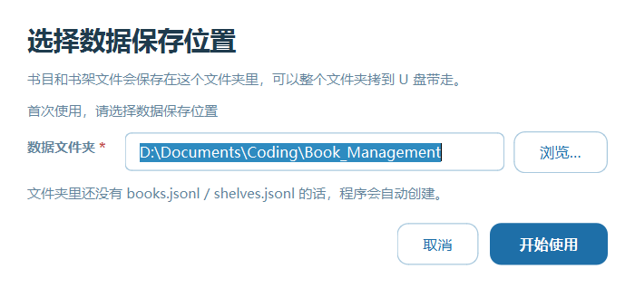
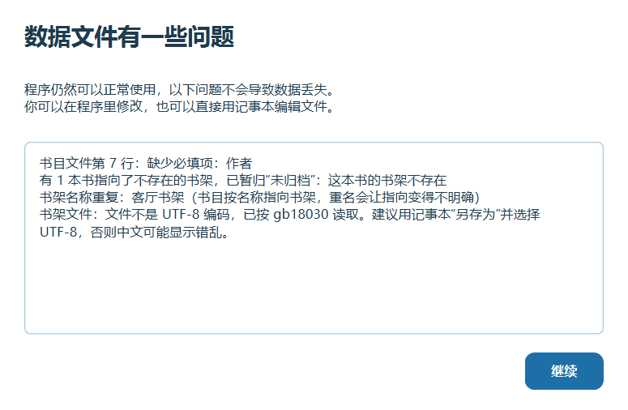

# 家庭图书管理系统 · HomeLibraryManager

> ## 🤖 本项目完全由 AI 创作
>
> 架构、代码、测试、界面设计、文档——**全部由 AI 生成**，人类只负责提出需求和反馈问题。
>
> **作者不保留任何权利。** 本项目自己编写的代码已捐献至**公有领域**
> （[Unlicense](LICENSE)）：你可以自由复制、修改、商用、再分发，**无需署名**。
>
> ⚠️ **但 Qt 5.15 与 PySide2 是 LGPL v3 的第三方库，不随本项目进入公有领域。**
> 分发二进制前请阅读 [第三方组件](THIRD-PARTY-NOTICES.md)——它说明了 LGPL 要求你做的三件事，
> 以及为什么 Qt 的著作权不可能被任何人放弃。

一个免安装的家庭藏书管理程序。整个文件夹解压出来双击就能用，不写注册表、不需要管理员权限、不需要预装任何运行环境。

- **Windows 7 SP1 及以上**（32 位构建可用同一套源码生成，见下文）
- **Linux / macOS** 用同一套源码，运行 `python -m homelibrarymanager`
- 数据是**纯文本**，可以直接用记事本打开和编辑

---

## 界面

左侧书架、右侧书卡。窗口可自由缩放，从 800×600 到 4K 都适配。



**全部书目**视图会把每本书所属的书架标在卡片右上角：



<details>
<summary><b>其余界面</b>（添加/编辑图书、添加/编辑书架、删除确认、启动流程）</summary>

<br>

| 添加图书 | 编辑图书 |
|---|---|
|  |  |

| 添加书架 | 编辑书架 |
|---|---|
|  |  |

| 删除书架（先决定书的去向） | 删除确认（默认按钮是「取消」） |
|---|---|
|  |  |

| 选择数据保存位置 | 数据文件有问题时的提示 |
|---|---|
|  |  |

</details>

---

## 快速开始（普通用户）

1. 解压 `HomeLibraryManager-<版本>-win64-portable.zip`
2. 双击 `HomeLibraryManager.exe`
3. 第一次运行会让你选一个**数据文件夹**，之后每次启动直接进主界面

```
HomeLibraryManager\
├── HomeLibraryManager.exe      ← 双击这个
├── books.jsonl                 ← 书目（可直接用记事本编辑）
├── shelves.jsonl               ← 书架（同上）
├── settings.ini                ← 记住上次选的目录和窗口大小
└── ...（Qt 与 Python 运行库，不要删）
```

### ⚠️ 三个必须知道的现实问题

**1. Windows 7 需要先装两个补丁**

程序依赖「通用 C 运行时」（UCRT），Windows 7 SP1 默认没有：

| 补丁 | 作用 |
|---|---|
| **KB2999226** | 通用 C 运行时（UCRT） |
| **KB2533623** | `AddDllDirectory`，Python 3.8 启动必需 |

Windows 8 及以上自带，无需处理。没打补丁时程序会直接启动失败。

**2. 第一次运行可能被 SmartScreen 拦一下**

从网上下载的 ZIP 解压后，Windows 会给文件打上「来自 Internet」标记，双击 exe 可能弹「Windows 已保护你的电脑」。**这跟程序本身无关，是没有代码签名证书的必然结果。**

解决：右键 `HomeLibraryManager.exe` → 属性 → 勾选「解除锁定」；或在弹窗里点「更多信息 → 仍要运行」。

**3. 不要解压到 `C:\Program Files`**

那里不可写。程序不会崩——它会自动把数据改存到「我的文档\HomeLibraryManager」并告诉你——但不如直接放桌面或 D 盘省事。

---

## 数据文件

两个文件都是 **UTF-8 带 BOM + CRLF 换行**。这不是随意选择：

- **BOM** —— Windows 7 的记事本不能自动识别不带 BOM 的 UTF-8，会按 GBK 读，中文全是乱码
- **CRLF** —— Windows 7 的记事本只认 CRLF，纯 LF 的文件会显示成一整行

**一行一条记录**，手改改错一行只丢那一行，不会导致整个书库打不开。

### `shelves.jsonl`（书架）

```
{"_format":"hlm-catalog","_version":1}
{"name":"客厅书架","sequence":"1","note":"客厅东墙，靠窗"}
{"name":"卧室床头柜","sequence":"2","note":"常读的放这里"}
```

| 字段 | 必填 | 说明 |
|---|---|---|
| `name` | ✅ | 书架名称。**不能重名**——书目按名称指向书架 |
| `sequence` | ✅ | 书架序号。数字、字母、汉字都行，按自然顺序排序（`2` 在 `10` 前） |
| `note` | | 介绍说明 |

### `books.jsonl`（书目）

```
{"_format":"hlm-catalog","_version":1}
{"title":"三体","author":"刘慈欣","shelf":"客厅书架","isbn":"9787536692930","published":"2008-01"}
{"title":"百年孤独","author":"加西亚·马尔克斯","shelf":"书房铁架","translator":"范晔","isbn":"9787544253994"}
```

| 字段 | 必填 | 说明 |
|---|---|---|
| `title` | ✅ | 书名 |
| `author` | ✅ | 作者 |
| `shelf` | ✅ | 所在书架，必须是 `shelves.jsonl` 里已有的名称 |
| `translator` | | 译者 |
| `isbn` | | ISBN 书号（搜索时忽略连字符） |
| `published` | | 出版时间，自由文本（`2008` / `2008-01` / `2008年5月` 都行） |
| `note` | | 备注 |

### 程序对你的手改是宽容的

- **自己加的字段不会被删掉**。写 `"借给":"爸爸"` 进去，程序保存时会原样保留，而且**能搜到**
- **写错一行只丢那一行**，其余照常加载，并告诉你第几行出错
- **记事本存成了 ANSI/GBK 也能读**，程序会自动回退并提醒你另存为 UTF-8
- **保存前自动备份**为 `.bak`，且**写入是原子的**（断电不会留下半个文件）
- **文件编码完全读不出来时**才会问你要不要新建，而且旧文件是**改名归档，绝不删除**

---

## 开发者

### 仓库里没有什么

以下都是**运行时产物或可再生的中间文件**，已在 `.gitignore` 中排除：

| 不提交 | 原因 |
|---|---|
| `books.jsonl` / `shelves.jsonl` | 运行时数据。仓库根目录在开发时就是程序的数据目录 |
| `settings.ini` / `crash.log` | 同上，而且是本机相关的 |
| `.venv/`（约 356 MB） | 开发环境，`pip install -r requirements-dev.txt` 可重建 |
| `.wheels/`（约 135 MB） | 离线依赖缓存，方便断网重建 |
| `build/` `dist/` | PyInstaller 产物；ZIP 走 GitHub Releases |

> **`.gitattributes` 不是格式洁癖。** 它强制 `*.jsonl` 保持 CRLF 换行。Windows 7 的记事本会把纯 LF 的文件显示成一整行，而"能用记事本打开编辑"正是这两个文件存在的意义。Git 默认的换行符归一化会在检出时悄悄改掉它们——程序仍然读得懂，但**你打开时会以为文件坏了**。

### 环境

| 组件 | 版本 | 为什么是这个版本 |
|---|---|---|
| Python | **3.8.10** | 最后一个支持 Windows 7 的 Python（3.9 起要求 Win8.1+） |
| PySide2 | **5.15.2.1** | 对应 Qt 5.15，最后一个支持 Windows 7 的 Qt（Qt 6 起要求 Win10） |
| PyInstaller | **5.13.2** | 打包工具 |
| pip | ≥ 24 | 21.3 之前的 pip 走代理会崩（`check_hostname requires server_hostname`） |

```bash
py -3.8 -m venv .venv
.venv\Scripts\python.exe -m pip install PySide2==5.15.2.1 pyinstaller==5.13.2
```

### 运行

```bash
.venv\Scripts\python.exe run.py
```

### 测试

```bash
.venv\Scripts\python.exe -m unittest discover -s tests
```

130+ 个测试，**其中绝大多数不启动 Qt**——数据层、逻辑层、搜索都能脱离界面验证。

### 打包

```bash
.venv\Scripts\python.exe tools\build_windows.py
```

流程：生成图标资源 → 校验 Windows 7 兼容性 → PyInstaller → **对产物跑 `--self-test`** → 打 ZIP。

第 4 步是必要的：一个 PyInstaller 包可以完美生成却起不来（缺少 Qt 插件或数据文件在构建期是静默的）。`--self-test` 会真的把窗口渲染出来再退出。

### 预览界面（不用启动程序）

`previews\` 里的截图由这个工具生成，改了界面后重新跑一遍就能保持文档同步：

```bash
.venv\Scripts\python.exe tools\render_preview.py out.png main
.venv\Scripts\python.exe tools\render_preview.py out.png add-book
```

可用视图：`main` `all-books` `add-book` `edit-book` `add-shelf` `edit-shelf` `delete-shelf` `confirm-delete` `choose-folder` `warnings`。

用原生平台 + `WA_DontShowOnScreen` 渲染（**不是** offscreen 平台——它在 Windows 上没有字体库，文字会渲染成空白）。

### 目录结构

```
src/homelibrarymanager/
├── config.py            应用身份、文件名、便携路径解析、资源路径
├── core/                纯数据对象，无 I/O 无 Qt
│   ├── models.py        Shelf / Book
│   └── errors.py        错误类型
├── data/                持久化层，无 Qt
│   ├── jsonl.py         BOM + CRLF + 原子写入 + 行级容错
│   ├── library.py       加载/保存/校验/关联/改名/删除
│   └── settings.py      settings.ini（configparser，不写注册表）
├── services/            用例层，无 Qt
│   ├── startup.py       启动分类与时机判断
│   ├── validation.py    表单与文件共用的校验规则
│   └── search.py        搜索匹配
└── ui/                  唯一引入 PySide2 的地方
    ├── theme.py         全部颜色与 QSS（自定义主题接口）
    ├── dpi.py           HiDPI 与窗口尺寸
    ├── startup_flow.py  启动流程编排
    ├── main_window.py   主窗口装配
    ├── widgets/         卡片、书架列表、流式布局、三点按钮…
    └── dialogs/         全部继承 FormDialog，风格由基类保证一致
```

**架构约束**：`core` / `data` / `services` 里没有一行 Qt。这让它们能脱离界面测试，也让将来加封面图、导入导出不必碰持久化代码。

### 自定义主题

所有颜色都是 `Theme` 数据类的字段，界面代码里没有一处硬编码：

```python
from homelibrarymanager.ui.theme import Theme, register_theme, apply_theme, get_theme

register_theme(Theme(name="dark", display_name="深色", primary="#2B3A4A", ...))
apply_theme(app, get_theme("dark"))
```

`arrow-down.png` 是唯一需要重新生成的资源（下拉框箭头），跑 `tools/make_assets.py` 即可。

---

## 已知限制

- **`HomeLibraryManager` 与 App Store 上一个同类应用同名。** 家庭自用无影响；若要公开发布建议换前缀（名字集中在 `config.py` 的三个常量里，改动成本很低）
- **不支持封面图与导入导出**，但架构上已预留（见上文"架构约束"）
- **Windows 7 之外未实机验证**。Win7 兼容性是通过读取 PE 头（bootloader 最低系统 5.2、无 Win8+ API）确认的，不是实机测试
- 书目中的**书架是必填的**，所以删除一个有书的书架时必须先决定书的去向（移到别的架或一起删），不会留下无主数据
